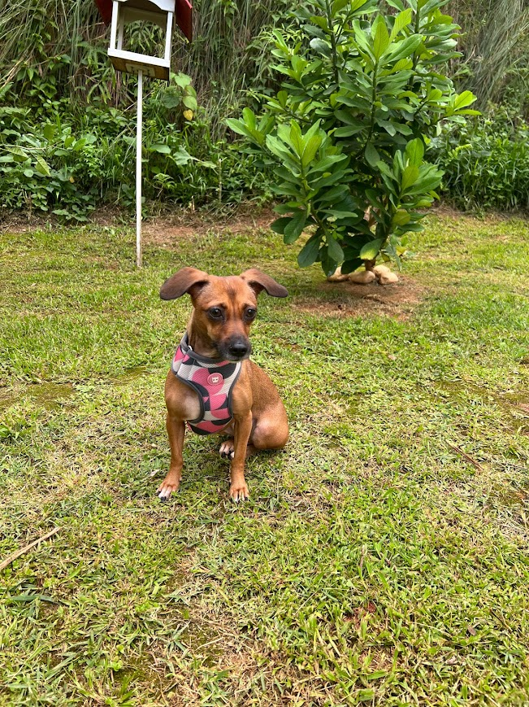
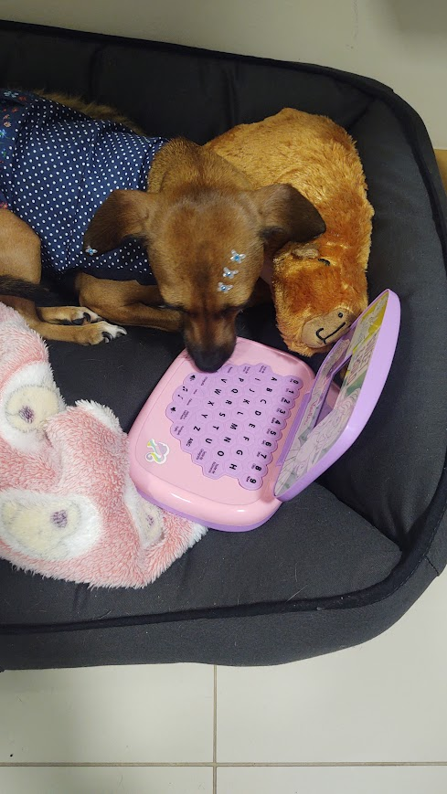
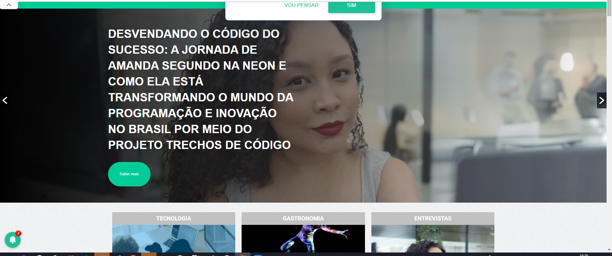
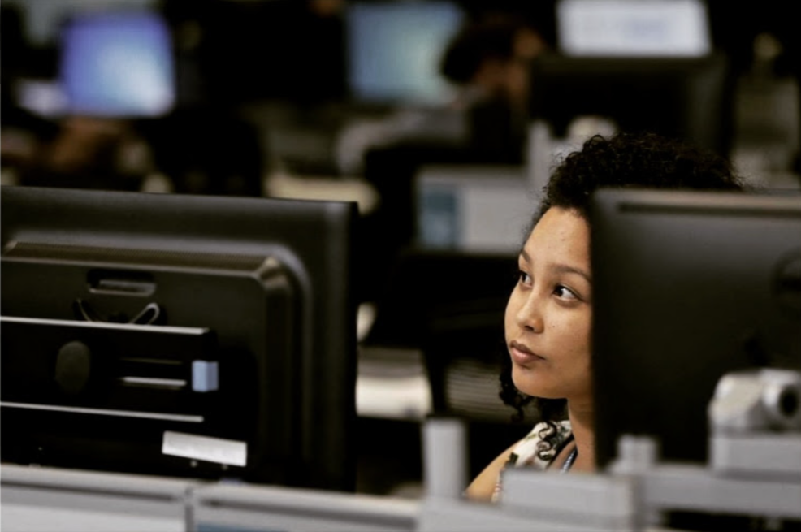

# Live de Teste

*"Era para ser apenas uma Live de Teste, mas ela durou mais de duas horas"*

*Amanda Segundo*

## Nina (minha Pet)

### Comandos

Gosto de treinar a [Nina](https://www.instagram.com/minhasmeninas.pet) e hoje ela sabe fazer os seguintes comandos: 
- Senta
- Pata
- Deita
- Rola
- Bang (fingir de morta) 
- Gira
- Em pé 
- Acena
- Toca aqui

Ela gosta de me ver trabalhando, então dei um notebook para ela me ajudar no trabalho (hahahha).

## Músicas

Tenho um gosto variado por música, mas últimamente tenho escutado as seguintes músicas:

- [Clássicas](https://music.youtube.com/playlist?list=PLQqx4coIe76_0lzHGljFUqr4EdNg4OTIM&si=nMWhMFv0RxGm493M)
- [LuxBeats](https://music.youtube.com/playlist?list=PLQqx4coIe76_vNODIjsN7FN7omJG_3pmw&si=r5uKwht5K562cz2r)
- [DJ Alan Walker](https://music.youtube.com/channel/UCaXJEi-wOOVe2eZZHzyz4mQ)
- [K-Pop](https://music.youtube.com/playlist?list=PLQqx4coIe768etyUTkb8G5-3ajAM9Ezqn&si=Wgdv23WCa74ORfVm)
- [Lo-Fi](https://music.youtube.com/playlist?list=PLQqx4coIe76-VsYoeHMO18btZSU2vB_YC&si=_9hrL1XwLQTV-dMR)

## Tech Girls favoritas (gringas)

Para o perfil [@amandasegundo.dev](https://www.instagram.com/amandasegundo.dev/) pretendo ter conteúdos mais sérios, profissionais e pessoais e me inspiro nas seguintes profissionais de TI:

- [@tiffintech](https://www.instagram.com/tiffintech)
- [@joeel56](https://www.instagram.com/joeel56)
- [@herhelloworld](https://www.instagram.com/herhelloworld)
- [@coding_unicorn](https://www.instagram.com/coding_unicorn)

## Notícia na Tecnoveste

- [Entrevista completa](https://www.tecnoveste.com.br/desvendando-o-codigo-do-sucesso-a-jornada-de-amanda-segundo-na-neon-e-como-ela-esta-transformando-o-mundo-da-programacao-e-inovacao-no-brasil-por-meio-do-projeto-trechos-de-codigo/)
- [Texto no Instagram](https://www.instagram.com/p/C14sECwOZbO/?utm_source=ig_web_copy_link)

## Podcast do TI da Depressão

Participei do podcast [@podcastspamtalk](https://www.instagram.com/podcastspamtalk/) do Luan Morais da página [tidadepressao](https://www.instagram.com/tidadepressao).

[Live completa aqui](https://www.instagram.com/p/CiRAS7oIeR7/?utm_source=ig_web_copy_link)

## Referências em Liguagens

### GO

- [William Queiroz](https://www.instagram.com/wnqueiroz.dev/)
- [Ellen Korbes](https://www.youtube.com/@AprendaGo)

### Python

- [Daniel Rodrigues](https://www.linkedin.com/in/morfiga/)

## Philips

Veja como é trabalhar na Philips no perfil [@lifeatphilips](https://www.instagram.com/lifeatphilips/).

## Conhecimentos Hackes

Estudei Segurança da Computação na faculdade de Tecnologia em Análise e Desenvolvimento de Sistemas no Instituto Federal Catarinense, meu professor foi o [Ricardo de la Rocha Ladeira](http://lattes.cnpq.br/6253824471671505).

## Gostou da Live?

☕️ Compre um café para mim:

PIX: d29ce6e0-7c0d-4fc2-ab12-3f8e1815258a

